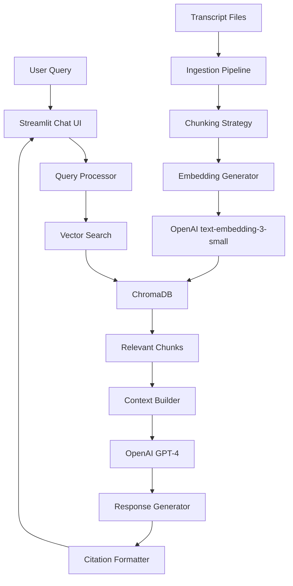
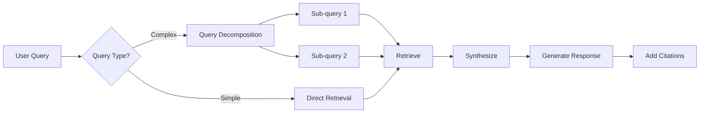

# PM Assistant with Lenny - Technical Plan

## Executive Summary

Build a RAG-based (Retrieval-Augmented Generation) agentic system that surfaces insights from Lenny's Podcast transcripts to help product managers, designers, and builders get expert advice. The system will use OpenAI for LLM capabilities, ChromaDB for vector storage, and Streamlit for the chat interface.

## Current Repository Analysis

### Structure
- **303 episode transcripts** organized in [`episodes/{guest-name}/transcript.md`](episodes/)
- **YAML frontmatter** with metadata: guest, title, youtube_url, publish_date, keywords, etc.
- **Topic index** in [`index/`](index/) with 93 topics linking episodes (e.g., [`product-management.md`](index/product-management.md) has 142 episodes)
- **Timestamped dialogue** format: `Speaker (timestamp): content`

### Key Insights
1. Transcripts are large (25,000+ tokens each)
2. Already indexed by topics/keywords
3. Rich metadata available for filtering
4. Content is conversational with speaker attribution
5. Timestamps enable precise citation

## System Architecture

### High-Level Design



### Components

#### 1. Data Ingestion Pipeline
**Purpose**: Process transcripts into searchable chunks with embeddings

**Process**:
- Parse YAML frontmatter for metadata
- Extract speaker dialogue with timestamps
- Chunk transcripts intelligently (semantic chunking)
- Generate embeddings using OpenAI
- Store in ChromaDB with metadata

**Chunking Strategy**:
- **Semantic chunking**: Group by topic/conversation flow (500-1000 tokens)
- **Overlap**: 100 tokens between chunks for context continuity
- **Metadata preservation**: guest, title, topic keywords, timestamp, youtube_url

#### 2. Vector Database (ChromaDB)
**Why ChromaDB**:
- Lightweight, embedded database (no separate server)
- Free and open-source
- Persistent storage
- Built-in similarity search
- Easy to deploy with Streamlit

**Schema**:
```python
{
    "id": "brian-chesky-chunk-001",
    "embedding": [0.123, ...],  # 1536-dim vector
    "text": "actual transcript chunk",
    "metadata": {
        "guest": "Brian Chesky",
        "episode_title": "Brian Chesky's new playbook",
        "youtube_url": "https://...",
        "timestamp": "00:01:01",
        "keywords": ["leadership", "product-management"],
        "publish_date": "2023-11-12",
        "chunk_index": 1
    }
}
```

#### 3. Retrieval System
**Hybrid Approach**:
1. **Vector similarity search**: Find semantically similar content
2. **Metadata filtering**: Filter by topic, guest, date if specified
3. **Re-ranking**: Score by relevance and recency

**Query Enhancement**:
- Extract intent (advice, example, framework, comparison)
- Identify key entities (companies, products, concepts)
- Expand with synonyms for better recall

#### 4. Agent Workflow
**Multi-step reasoning**:



**Agent Capabilities**:
- **Query understanding**: Classify intent and extract entities
- **Multi-hop reasoning**: Break complex questions into sub-queries
- **Source synthesis**: Combine insights from multiple episodes
- **Citation generation**: Link back to specific transcript sections

#### 5. OpenAI Integration
**Models**:
- **Embeddings**: `text-embedding-3-small` (cost-effective, 1536 dimensions)
- **Chat**: `gpt-4o-mini` (fast, affordable for prototyping)
- **Function calling**: For structured queries and metadata filtering

**Prompt Strategy**:
```
System: You are a PM advisor powered by insights from Lenny's Podcast. 
Provide actionable advice based on the retrieved transcript excerpts.
Always cite sources with guest names and episode titles.

Context: {retrieved_chunks}

User: {query}

Instructions:
1. Synthesize insights from multiple sources when relevant
2. Provide specific examples and frameworks mentioned
3. Include citations: [Guest Name - Episode Title (timestamp)]
4. If uncertain, acknowledge limitations
```

#### 6. Streamlit Chat Interface
**Features**:
- Clean chat UI similar to ChatGPT
- Message history with conversation memory
- Source citations as expandable sections
- Topic filter sidebar (optional)
- Example queries for onboarding

**Layout**:
```
┌─────────────────────────────────────┐
│  🎙️ PM Assistant with Lenny        │
├─────────────────────────────────────┤
│ [Sidebar]        │ [Chat Area]      │
│ - Example Qs     │ User: How do I   │
│ - Topic Filter   │ find PMF?        │
│ - Settings       │                  │
│                  │ Assistant: Based │
│                  │ on insights from │
│                  │ [citations]...   │
│                  │                  │
│                  │ [Input Box]      │
└─────────────────────────────────────┘
```

## Implementation Plan

### Phase 1: Data Preparation
1. **Parse transcripts** ([`episodes/`](episodes/))
   - Extract YAML frontmatter
   - Parse dialogue with timestamps
   - Validate data quality

2. **Implement chunking**
   - Semantic chunking by conversation flow
   - Preserve speaker context
   - Add overlap for continuity

3. **Generate embeddings**
   - Use OpenAI `text-embedding-3-small`
   - Batch processing for efficiency
   - Store in ChromaDB

### Phase 2: Core System
1. **Set up ChromaDB**
   - Initialize persistent database
   - Define collection schema
   - Implement indexing

2. **Build retrieval system**
   - Vector similarity search
   - Metadata filtering
   - Hybrid ranking

3. **Implement agent logic**
   - Query processing
   - Context building
   - Response generation with citations

### Phase 3: User Interface
1. **Streamlit app**
   - Chat interface
   - Message history
   - Citation display

2. **Conversation memory**
   - Session state management
   - Context window management
   - Follow-up question handling

### Phase 4: Testing & Deployment
1. **Test queries**
   - Common PM questions
   - Edge cases
   - Citation accuracy

2. **Deploy to Streamlit Cloud**
   - Free tier (sufficient for <5 users)
   - Environment variables for API keys
   - Persistent ChromaDB storage

## Technology Stack

### Core Dependencies
```python
streamlit==1.31.0           # Chat UI
chromadb==0.4.22            # Vector database
openai==1.12.0              # LLM & embeddings
langchain==0.1.9            # Optional: RAG utilities
pyyaml==6.0.1               # Parse frontmatter
python-dotenv==1.0.0        # Environment variables
```

### Project Structure
```
pm-assistant-with-lenny/
├── app.py                  # Streamlit app entry point
├── src/
│   ├── ingestion/
│   │   ├── parser.py       # Parse transcripts
│   │   ├── chunker.py      # Semantic chunking
│   │   └── embedder.py     # Generate embeddings
│   ├── retrieval/
│   │   ├── vector_store.py # ChromaDB interface
│   │   └── retriever.py    # Hybrid retrieval
│   ├── agent/
│   │   ├── query_processor.py
│   │   ├── context_builder.py
│   │   └── response_generator.py
│   └── ui/
│       ├── chat.py         # Chat components
│       └── citations.py    # Citation formatting
├── data/
│   └── chroma_db/          # Persistent vector DB
├── scripts/
│   └── ingest_transcripts.py  # One-time ingestion
├── requirements.txt
├── .env.example
├── .gitignore
└── README.md
```

## Future Extensibility

### Adding New Knowledge Sources
**Design Principles**:
1. **Modular ingestion**: Each source has its own parser
2. **Unified schema**: All sources map to same vector DB schema
3. **Source attribution**: Metadata tracks origin

**Example Sources**:
- Product management books (PDF/EPUB)
- Blog posts and articles
- Case studies
- Research papers
- User-submitted content

**Implementation**:
```python
# Abstract base class
class KnowledgeSource:
    def parse(self) -> List[Document]
    def chunk(self, docs) -> List[Chunk]
    def get_metadata(self) -> Dict

# Concrete implementations
class TranscriptSource(KnowledgeSource): ...
class BookSource(KnowledgeSource): ...
class ArticleSource(KnowledgeSource): ...
```

### Scaling Considerations
**Current (Free Tier)**:
- Streamlit Cloud: 1GB RAM, shared CPU
- ChromaDB: Embedded, ~500MB for all transcripts
- OpenAI: Pay-per-use (embeddings + chat)

**Future Scaling**:
- **More users**: Upgrade Streamlit or move to dedicated hosting
- **Larger dataset**: Consider Pinecone/Weaviate for managed vector DB
- **Cost optimization**: Cache embeddings, use smaller models

## Cost Estimation (Free Tier)

### One-time Setup
- **Embeddings**: 303 episodes × ~10 chunks × $0.00002/1K tokens ≈ $0.60
- **Storage**: ChromaDB (free, local)

### Per-query Cost
- **Retrieval**: Free (local ChromaDB)
- **LLM**: ~1000 tokens × $0.00015/1K tokens ≈ $0.0002/query
- **Monthly (100 queries)**: ~$0.02

**Total**: Essentially free for <5 users with light usage

## Success Metrics

### Quality Metrics
- **Relevance**: Are retrieved chunks relevant to query?
- **Citation accuracy**: Do citations match content?
- **Response quality**: Is advice actionable and accurate?

### User Metrics
- **Query success rate**: % of queries with satisfactory answers
- **Follow-up rate**: % of users asking follow-ups (engagement)
- **Source diversity**: Average # of episodes cited per response

## Risks & Mitigations

| Risk | Impact | Mitigation |
|------|--------|------------|
| Large transcript files | Slow processing | Implement streaming, chunking |
| Embedding costs | Budget overrun | Cache embeddings, batch processing |
| Poor retrieval quality | Bad UX | Hybrid search, re-ranking, user feedback |
| Hallucinations | Incorrect advice | Strong prompts, citation requirements |
| Streamlit limits | Can't scale | Document migration path to dedicated hosting |

## Next Steps

1. **Review this plan** with stakeholders
2. **Set up development environment**
3. **Start with Phase 1**: Ingest 5-10 transcripts as proof of concept
4. **Build minimal viable interface**: Simple Q&A without advanced features
5. **Iterate based on testing**: Improve retrieval and response quality
6. **Deploy to Streamlit Cloud**: Share with initial users
7. **Gather feedback**: Refine based on real usage

## Questions for Consideration

1. Should we prioritize certain topics/guests for initial ingestion?
2. Do you want topic filtering in the UI, or pure semantic search?
3. Should the system support multi-turn conversations with context?
4. Any specific PM frameworks or concepts to emphasize?
5. Preference for response style (concise vs detailed)?

---

**Ready to proceed?** Once you approve this plan, I can switch to Code mode to begin implementation.